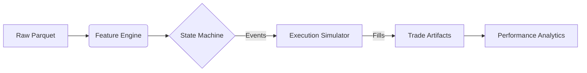

# Meridian

[](https://github.com/sukesan7/meridian/actions)
[](LICENSE)
[](https://www.python.org/downloads/)
[](https://github.com/astral-sh/ruff)
[](https://mypy-lang.org/)

**Meridian** is a deterministic, event-driven backtesting engine created for the high-fidelity simulation of intraday futures strategies. It prioritizes correctness, causal integrity, and reproducibility over raw execution speed, serving as a rapid prototyping environment for **Strategy 3A** (VWAP Trend Pullback) logic.

The system is currently deployed to validate a singular strategy (**Strategy 3A**) on **Nasdaq-100 (NQ)** futures data, enforcing strict session boundaries and regime-adaptive execution models.

---

## 1. Core Philosophy & Architecture

Meridian addresses the "Backtest-Reality Gap" prevalent in quantitative research by enforcing a strict **Data Contract** and **State Machine** execution model.

### Key Engineering Principles
* **Semantic Determinism:** Identical inputs (Data, Config, Seed) guarantee identical PnL and trade artifacts. This property is enforced via regression tests in the CI/CD pipeline.
* **Causal Integrity & Latency Simulation:** The engine adheres to strict causality in both signal generation and execution. It enforces `n-bar` delays on indicators and simulates execution latency by filling orders at the Next Bar Open, eliminating the "optimistic fill" bias common in close-on-close backtesters.
* **Session-Aware Execution:** Native handling of exchange timezones (`America/New_York`) and RTH (09:30–16:00 ET) boundaries prevents signal leakage across trading sessions.
* **Regime-Adaptive Friction:** Slippage models are time-variant, applying higher friction during high-volatility windows (e.g., the "Hot Window" during the 09:30 Opening Range).

### Data Flow Pipeline
The engine operates as a unidirectional pipeline, transforming raw vendor data into auditable trade artifacts.



---

## 2. Strategy Logic (Strategy 3A)

The engine implements a multi-stage finite state machine (FSM) to identify high-probability setups. Unlike simple vector crossovers, **Strategy 3A** requires a specific sequence of market states:

1.  **Unlock Phase:** The system monitors for a volatility expansion (Opening Range Breakout) aligned with the 5-minute trend structure.
2.  **Zone Phase:** Once unlocked, the engine waits for a mean-reversion pullback into the value area (VWAP +- 1$\sigma$).
3.  **Trigger Phase:** Trades are executed only upon confirmation of a micro-structure breakout (Confirmed Swing High/Low) within the value zone.

### Logic Visualization (v1.0.2)
*Trace of the State Machine during a typical session. Note the strict delay in Swing High (Red Triangle) confirmation, proving causal integrity.*


---

## 3. Performance (v1.0.2 Baseline)

*Audited results derived from a 12-month In-Sample (IS) period on NQ (2024-2025). Metrics reflect the correction of look-ahead bias and the enabling of news-day trading and causal execution protocols.*

| Metric         | Value      | Description                                |
| :------------- | :--------- | :----------------------------------------- |
| **Expectancy** | **0.20 R** | Risk-adjusted return per trade (Realized). |
| **Win Rate**   | **59.0%**  | Trend-following profile.                   |
| **SQN**        | **1.69**   | System Quality Number.                     |
| **Drawdown**   | **4.26 R** | Maximum Peak-to-Valley (Walk-Forward).     |

### Market Regime Analysis
*The engine filters sessions based on volatility regimes (True Range Distribution), rejecting low-opportunity "Compressed" days.*


---

## 4. Repository Layout

The project follows a modular package structure designed for maintainability and testing.

```text
.
├── .github/workflows/                 # CI/CD pipeline definition
├── configs/                           # Strategy execution parameters (YAML)
├── data/                              # Data lake (parquet storage)
├── docs/                              # System documentation & performance reports
├── assets/                            # Visualization artifacts
├── s3a_backtester/                    # Core package source
│   ├── cli.py                         # Entrypoint (backtest / walkforward / mc)
│   ├── engine.py                      # Signal state machine & event loop
│   ├── features.py                    # Vectorized indicator calculation
│   ├── management.py                  # Trade lifecycle (TP/SL/Time-stops)
│   ├── slippage.py                    # Volatility-adjusted execution models
│   ├── walkforward.py                 # Rolling IS/OOS validation engine
│   └── ...
├── scripts/                           # ETL, Reporting, and Profiling utilities
├── tests/                             # Unit & Integration suite (pytest)
└── README.md
```

---

## 5. Quick Start

### Prerequisites
* Python 3.10+
* Dependencies managed via `pip` (Pandas, NumPy, PyArrow, SciPy, PyYAML)

### Installation
Clone the repository and install with development dependencies (required for running tests and synthetic data generation).

```bash
# Clone the repository
git clone [https://github.com/sukesan7/meridian.git](https://github.com/sukesan7/meridian.git)
cd meridian

# Set up virtual environment
python -m venv .venv
source .venv/bin/activate  # Windows: .venv\Scripts\activate

# Install strictly pinned dependencies + dev tools
pip install -e ".[dev]"
```

### Running a Demo (No Data Required)
If you do not possess proprietary NQ futures data, you can verify the engine's logic by running the test suite. The tests generate **synthetic market data** on the fly to validate the execution engine, slippage models, and state machine.

```bash
# Run full test suite with verbose output
pytest -v
```

---

## 6. Usage & Workflows

Meridian utilizes a unified CLI `meridian-run` for all simulation modes.

### A. Standard Backtest (In-Sample)
Executes the strategy over a fixed period and generates `trades.parquet` and `signals.parquet`.

```bash
meridian-run backtest \
  --config configs/base.yaml \
  --data data/vendor_parquet/NQ/NQ_2024_RTH.parquet \
  --run-id v1_0_2_baseline
```

### B. Walk-Forward Analysis (Robustness)
Performs rolling-window validation to detect overfitting. Default: 63-day Train / 21-day Test.

```bash
meridian-run walkforward \
  --config configs/base.yaml \
  --data data/vendor_parquet/NQ/NQ_2024_RTH.parquet \
  --is-days 63 --oos-days 21 \
  --run-id v1_0_2_wfo
```

### C. Monte Carlo (Risk Assessment)
Applies block-bootstrap resampling to the trade distribution to estimate tail risks and drawdown probabilities.

```bash
meridian-run monte-carlo \
  --config configs/base.yaml \
  --trades outputs/backtest/v1_0_2_baseline/trades.parquet \
  --n-paths 2500 \
  --seed 7
```

---

## 7. Engineering Standards & Quality Gates

This project enforces strict software engineering standards suitable for production environments.

* **Static Typing:** Fully typed codebase verified by `mypy --strict`. No `Any` types allowed in core logic.
* **Linting & Formatting:** Enforced via `ruff` (replaces Flake8/Black/Isort) for consistent style.
* **CI/CD Pipeline:** GitHub Actions automatically runs the test suite and type checkers on every push/PR.
* **Pre-Commit Hooks:** Local guardrails prevent committing failing code or large data files.
* **Dependency Locking:** Build environment is frozen using `pip-tools` and `requirements.lock` with hash verification, ensuring bit-perfect environment reproduction across machines and years.

To run the quality suite locally:
```bash
pre-commit run --all-files
```

---

## 8. Data Contract

Meridian requires 1-minute OHLCV data normalized to the `vendor_parquet` schema.

**Expected Columns:**
* `timestamp` (DatetimeTZ, UTC)
* `open`, `high`, `low`, `close` (Float64)
* `volume` (Float64/Int64)

**Pipeline Note:**
The engine internally converts UTC timestamps to `America/New_York` to align with US Equity Futures session timings (RTH 09:30 - 16:00 ET).

---

## 9. Future Roadmap

* **Performance:** Migration of the core `engine.py` loop from Pandas/NumPy to **Polars** (Rust) for improved vectorization throughput and zero-copy memory management.
* **Statistical Rigor:** Implementation of **Combinatorial Purged Cross-Validation (CPCV)** and **Deflated Sharpe Ratio (DSR)** to explicitly quantify and penalize multiple testing bias in strategy selection.
* **Market Microstructure:** Upgrade of execution models to include **Vectorized Market Impact** (e.g., Square Root Law) for liquidity-dependent slippage, alongside L2 order book pressure integration.
* **Generative Risk:** Integration of **Hidden Markov Models (HMM)** to generate synthetic market regimes for robust Monte Carlo stress testing beyond historical bootstrapping.
* **Multi-Asset Support:** Architecture extensions to support execution logic on Equities, ETFs, and other futures contracts.
* **Strategy Expansion:** Implementation and validation of complementary strategies (**Strategy 1A**, **2A**, **4A**) to diversify the portfolio.

---

## Disclaimer

**Educational & Research Use Only.**
Meridian is a software tool for quantitative analysis. It does not constitute financial advice. Past performance in simulation is not indicative of future results in live trading. Execution models are approximations and cannot fully replicate live market microstructure (latency, queue position, impact).
