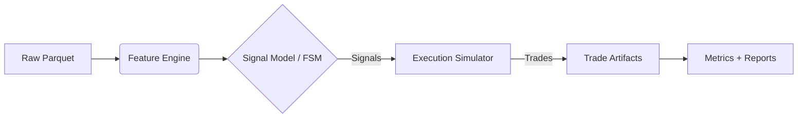
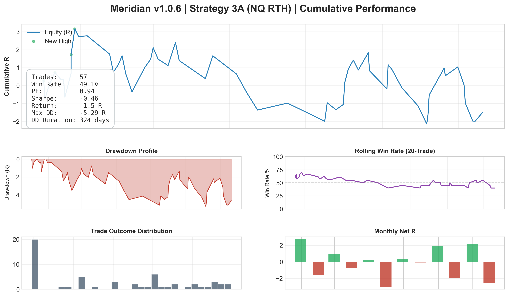
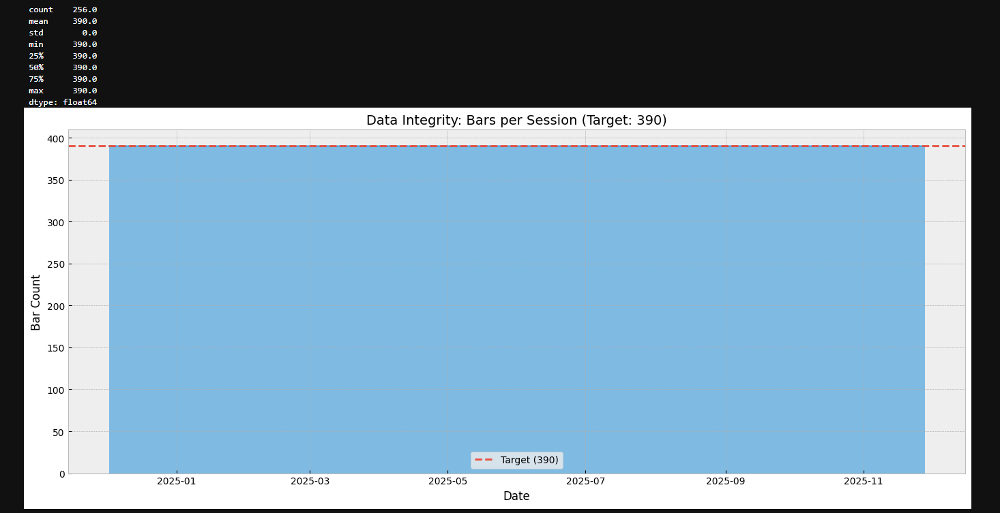
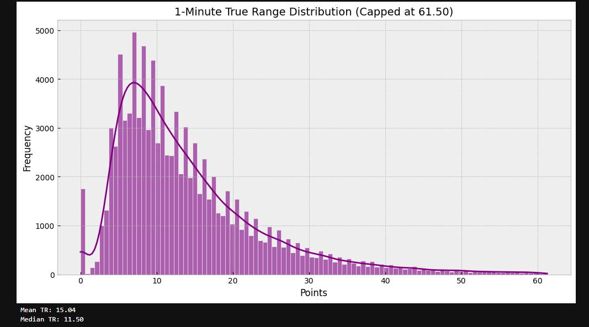

# Meridian

[](https://github.com/sukesan7/meridian/actions)
[](LICENSE)
[](https://www.python.org/downloads/)
[](https://github.com/astral-sh/ruff)
[](https://mypy-lang.org/)

**Meridian** is a deterministic, event-driven backtesting engine for high-fidelity simulation of intraday futures strategies.
It is built to minimize the “backtest ↔ reality gap” by enforcing:

- **Causal feature generation** (no session leakage / no look-ahead)
- **Execution realism** (next-bar-open fills, slippage, fill-time risk constraints)
- **Reproducibility** (config snapshots + seed + immutable run artifacts)

Meridian is currently used to research **Strategy 3A (VWAP Trend Pullback)** on **Nasdaq-100 (NQ)** futures data, but the engine is designed to be reusable across strategies.

---

## 1. Core Philosophy

### Key Engineering Principles
- **Semantic determinism:** identical inputs (data + config + seed) produce identical outputs (signals/trades/summary).
- **Causal integrity:** signals are generated from information available *at or before* the decision timestamp; executions are filled using *future* bars only via a controlled latency model (e.g., next-bar-open).
- **Session awareness:** strict RTH slicing (09:30–16:00 ET) and timezone normalization to prevent cross-session leakage.
- **Auditable artifacts:** every run writes an artifact bundle that can be diffed, hashed, and reviewed.

### Data Flow Pipeline



---

## 2. Strategy Logic (Strategy 3A)

Strategy 3A is implemented as a multi-stage finite state machine (FSM) with explicit gating stages:

1. **Unlock:** volatility expansion aligned with higher-timeframe structure.
2. **Zone:** pullback into VWAP value area (e.g., VWAP ± bands).
3. **Trigger:** micro-structure confirmation (e.g., confirmed swing + break) before entry.

> Meridian is the tool. Strategy 3A is the current reference implementation.

---

## 3. Results & Reporting
Meridian writes **immutable run outputs** on every execution:

- `run_meta.json` — config snapshot + seed + command argv + (optional) data SHA256 + artifact SHA256s
- `summary.json` — hashable summary metrics
- `signals.parquet` — (optional) signal table for debugging
- `trades.parquet / trades.csv` — execution log with `signal_time` vs `entry_time`
- `docs/system/STRATEGY_RESULTS.md` (generated by `scripts/make_report.py`)

Below is an example performance dashboard generated from a single backtest run.
It is intended to demonstrate Meridian’s **artifact-backed reporting** and **diagnostic coverage** (equity in R, drawdown profile, rolling win rate, trade outcome distribution, monthly net R).

- This figure is **generated from run artifacts** (`trades.parquet`, `summary.json`, `run_meta.json`) and is reproducible given the same inputs/config.
- Results shown are **not a profitability claim**. They reflect the specified execution model (e.g., next-bar-open fills + slippage + fill-time risk constraints) and serve as a correctness/debugging tool.
- The goal is to make it easy to spot modeling issues: regime dependence, drawdown persistence, skew/fat tails, and instability in rolling hit-rate.



---

## 4. Data Verification

### A) Session Density
RTH 1-minute sessions should contain **390 bars** (09:30–15:59 ET). This validates no missing intraday gaps.



### B) Volatility Regime
True Range distribution identifies volatility regimes; filters gate entries during extreme conditions.



---

## 5. Repository Layout

```text
.
├── .github/workflows/                 # CI/CD pipeline definition
├── configs/                           # Strategy execution parameters (YAML)
├── data/                              # Data lake (parquet storage)
├── docs/                              # System documentation & performance reports
├── assets/                            # Visualization artifacts
├── s3a_backtester/                    # Core package source
│   ├── cli.py                         # Entrypoint (backtest / walkforward / mc)
│   ├── engine.py                      # Signal state machine & event loop
│   ├── features.py                    # Vectorized indicator calculation
│   ├── management.py                  # Trade lifecycle (TP/SL/Time-stops)
│   ├── slippage.py                    # Volatility-adjusted execution models
│   ├── walkforward.py                 # Rolling IS/OOS validation engine
│   └── ...
├── scripts/                           # ETL, Reporting, and Profiling utilities
├── tests/                             # Unit & Integration suite (pytest)
└── README.md
```

---

## 6. Quick Start

### Prerequisites
- Python 3.10+
- Dependencies in `pyproject.toml`
- Locked installs supported via `requirements.lock`

### Installation

```powershell
git clone https://github.com/sukesan7/meridian.git
cd meridian

python -m venv .venv
source .venv/bin/activate  # Windows: .venv\Scripts\Activate.ps1

pip install -r requirements.lock
pip install -e .
```

### No proprietary data? Run tests.
The test suite generates synthetic market data to validate causality and execution correctness.

```bash
pytest -v
```

---

## 7. Usage

Meridian uses a unified CLI: `meridian-run`.

### Backtest

```bash
meridian-run backtest \
  --config configs/base.yaml \
  --data data/vendor_parquet/NQ/NQ.v.0_2024-12-01_2025-03-30_RTH.parquet \
  --out-dir outputs/backtest \
  --run-id v1_0_6_backtest_baseline \
  --seed 106
```

Optional integrity flags:
- `--hash-data` (computes SHA256 of the data file; can be slow for large files)

### Walkforward

```bash
meridian-run walkforward \
  --config configs/base.yaml \
  --data data/vendor_parquet/NQ/NQ.v.0_2024-12-01_2025-03-30_RTH.parquet \
  --out-dir outputs/walkforward \
  --run-id v1_0_6_walkforward_baseline \
  --is-days 63 \
  --oos-days 21 \
  --seed 106
```

### Monte Carlo (from trades file)

Monte Carlo operates on an existing trades artifact:

```bash
meridian-run monte-carlo \
  --config configs/base.yaml \
  --trades-file outputs/backtest/v1_0_6_backtest_baseline/trades.parquet \
  --out-dir outputs/monte-carlo \
  --run-id v1_0_6_montecarlo_baseline \
  --n-paths 2500 \
  --risk-per-trade 0.01 \
  --seed 106
```

---

## 8. Profiling

Use `scripts/profile_run.py` to profile any CLI command. **Important:** arguments after `--` are passed to `meridian-run`.

### Profile backtest

```bash
python scripts/profile_run.py \
  --out outputs/profiles/v1_0_6_baseline/backtest.prof \
  --top 75 \
  --sort cumtime \
  -- \
  backtest \
  --config configs/base.yaml \
  --data data/vendor_parquet/NQ/NQ.v.0_2024-12-01_2025-03-30_RTH.parquet \
  --out-dir outputs/backtest \
  --run-id v1_0_6_profile_backtest \
  --seed 106
```

### Profile walkforward

```bash
python scripts/profile_run.py \
  --out outputs/profiles/v1_0_6_baseline/walkforward.prof \
  --top 75 \
  --sort cumtime \
  -- \
  walkforward \
  --config configs/base.yaml \
  --data data/vendor_parquet/NQ/NQ.v.0_2024-12-01_2025-03-30_RTH.parquet \
  --out-dir outputs/walkforward \
  --run-id v1_0_6_profile_walkforward \
  --is-days 63 \
  --oos-days 21 \
  --seed 106
```

### Profile monte-carlo

```bash
python scripts/profile_run.py \
  --out outputs/profiles/v1_0_6_baseline/monte_carlo.prof \
  --top 75 \
  --sort cumtime \
  -- \
  monte-carlo \
  --config configs/base.yaml \
  --trades-file outputs/backtest/v1_0_6_backtest_baseline/trades.parquet \
  --out-dir outputs/monte-carlo \
  --run-id v1_0_6_profile_montecarlo \
  --n-paths 2500 \
  --risk-per-trade 0.01 \
  --seed 106
```

---

## 9. Consolidated Report Generation

After producing backtest/walkforward/monte-carlo + profiling timings, generate a publishable report:

```bash
python scripts/make_report.py \
  --label v1_0_6_baseline \
  --backtest outputs/backtest/v1_0_6_backtest_baseline \
  --walkforward outputs/walkforward/v1_0_6_walkforward_baseline \
  --monte-carlo outputs/monte-carlo/v1_0_6_montecarlo_baseline \
  --profile outputs/profiles/v1_0_6_baseline/backtest.timing.json \
  --profile outputs/profiles/v1_0_6_baseline/walkforward.timing.json \
  --profile outputs/profiles/v1_0_6_baseline/monte_carlo.timing.json \
  --out docs/system/STRATEGY_RESULTS.md
```

## 10. Engineering Standards & Quality Gates

This project enforces strict software engineering standards suitable for production environments.

* **Static Typing:** Fully typed codebase verified by `mypy` in CI. Enforces type safety to catch interface errors across the core engine and signal generation logic.
* **Linting & Formatting:** Enforced via `ruff` (replaces Flake8/Black/Isort) for consistent style.
* **CI/CD Pipeline:** GitHub Actions automatically runs the test suite and type checkers on every push/PR.
* **Reproducible Environments:** Strict dependency versioning is enforced via `requirements.lock`, ensuring identical execution environments on both Windows dev machines and Linux CI runners.
* **Determinism Gate:** Automated verification scripts ensure `Run A` and `Run B` produce semantically identical outputs, protecting against logic drift.

To run the quality suite locally:
```bash
# Format code
ruff format .

# Run static analysis
mypy s3a_backtester
```

### CI/CD Enforcement
Every PR triggers `verify_determinism.py`, where CI verifies semantic determinism by comparing normalized trade logs and summary outputs.

```yaml
# .github/workflows/ci.yml
- name: Verify Semantic Determinism
  run: |
    python scripts/debug_tools/verify_determinism.py \
      ci_artifacts/run_A/trades.parquet \
      ci_artifacts/run_B/trades.parquet
```

## 11. Data Contract

Meridian requires 1-minute OHLCV data normalized to the `vendor_parquet` schema.

**Expected Columns:**
* `timestamp` (DatetimeTZ, UTC)
* `open`, `high`, `low`, `close` (Float64)
* `volume` (Float64/Int64)

**Pipeline Note:**
The engine internally converts UTC timestamps to `America/New_York` to align with US Equity Futures session timings (RTH 09:30 - 16:00 ET).

---

## 12. Future Roadmap

* **Performance:** Migration of the core `engine.py` loop from Pandas/NumPy to **Polars** (Rust) for improved vectorization throughput and zero-copy memory management.
* **Statistical Rigor:** Implementation of **Combinatorial Purged Cross-Validation (CPCV)** and **Deflated Sharpe Ratio (DSR)** to explicitly quantify and penalize multiple testing bias in strategy selection.
* **Market Microstructure:** Upgrade of execution models to include **Vectorized Market Impact** (e.g., Square Root Law) for liquidity-dependent slippage, alongside L2 order book pressure integration.
* **Generative Risk:** Integration of **Hidden Markov Models (HMM)** to generate synthetic market regimes for robust Monte Carlo stress testing beyond historical bootstrapping.
* **Multi-Asset Support:** Architecture extensions to support execution logic on Equities, ETFs, and other futures contracts.
* **Strategy Expansion:** Implementation and validation of complementary strategies (**Strategy 1A**, **2A**, **4A**) to diversify the portfolio.

---
## Disclaimer

**Educational & Research Use Only.**
Meridian is a software tool for quantitative analysis. It does not constitute financial advice. Past performance in simulation is not indicative of future results in live trading. Execution models are approximations and cannot fully replicate live market microstructure (latency, queue position, impact).
