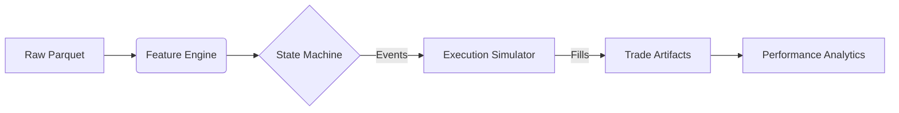
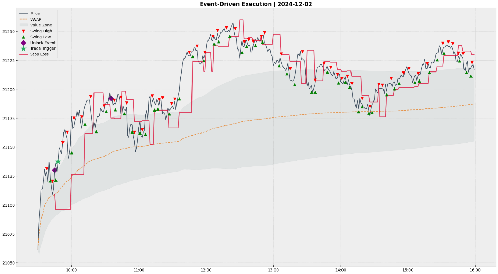
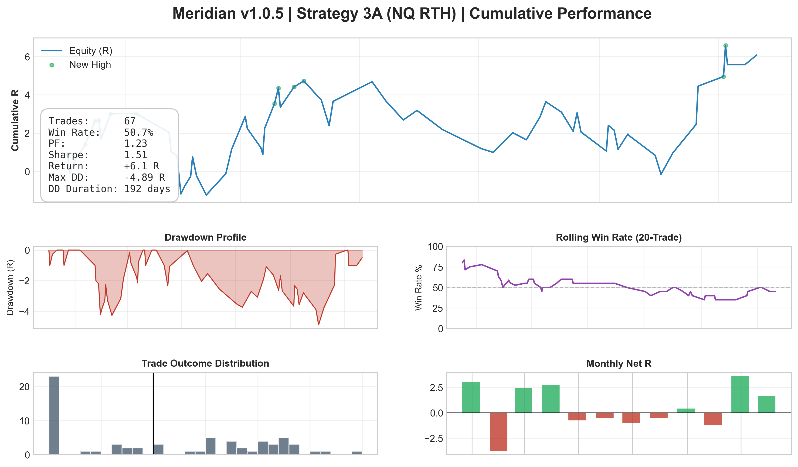

# Meridian

[](https://github.com/sukesan7/meridian/actions)
[](LICENSE)
[](https://www.python.org/downloads/)
[](https://github.com/astral-sh/ruff)
[](https://mypy-lang.org/)

**Meridian** is a deterministic, event-driven backtesting engine created for the high-fidelity simulation of intraday futures strategies. It prioritizes correctness, causal integrity, and reproducibility over raw execution speed, serving as a rapid prototyping environment for **Strategy 3A** (VWAP Trend Pullback) logic.

The system is currently deployed to validate a singular strategy (**Strategy 3A**) on **Nasdaq-100 (NQ)** futures data, enforcing strict session boundaries and regime-adaptive execution models.

---

## 1. Core Philosophy & Architecture

Meridian addresses the "Backtest-Reality Gap" prevalent in quantitative research by enforcing a strict **Data Contract** and **State Machine** execution model.

### Key Engineering Principles
* **Semantic Determinism:** Identical inputs (Data, Config, Seed) guarantee identical PnL and trade artifacts. This is enforced via a **Regression Gate** in CI, which verifies strict output stability and reproducibility across simulation runs.
* **Causal Integrity & Latency Simulation:** The engine adheres to strict causality in both signal generation and execution. It enforces `n-bar` delays on indicators and simulates execution latency by filling orders at the Next Bar Open, eliminating the "optimistic fill" bias common in close-on-close backtesters.
* **Session-Aware Execution:** Native handling of exchange timezones (`America/New_York`) and RTH (09:30–16:00 ET) boundaries prevents signal leakage across trading sessions.
* **Regime-Adaptive Friction:** Slippage models are time-variant, applying higher friction during high-volatility windows (e.g., the "Hot Window" during the 09:30 Opening Range).

### Data Flow Pipeline
The engine operates as a unidirectional pipeline, transforming raw vendor data into auditable trade artifacts.



---

## 2. Strategy Logic (Strategy 3A)

The engine implements a multi-stage finite state machine (FSM) to identify high-probability setups. Unlike simple vector crossovers, **Strategy 3A** requires a specific sequence of market states:

1.  **Unlock Phase:** The system monitors for a volatility expansion (Opening Range Breakout) aligned with the 5-minute trend structure.
2.  **Zone Phase:** Once unlocked, the engine waits for a mean-reversion pullback into the value area (VWAP +- 1$\sigma$).
3.  **Trigger Phase:** Trades are executed only upon confirmation of a micro-structure breakout (Confirmed Swing High/Low) within the value zone.

### Logic Visualization (v1.0.5)
*Trace of the State Machine during a typical session. Note the strict delay in Swing High (Red Triangle) confirmation, proving causal integrity.*



---

## 3. Performance (v1.0.5 Release)

*Audited results derived from a 12-month evaluation period on NQ (2024-2025). The metrics below reflect the strict enforcement of causal execution protocols, volatility gating, and accurate slippage modeling.*

### Overall Performance
| Metric | Value | Description |
| :--- | :--- | :--- |
| **Win Rate** | `50.7%` | Robust trend-following profile. |
| **Profit Factor** | `1.23` | Gross Win / Gross Loss. |
| **Sharpe Ratio** | `1.51` | Risk-adjusted return (Est. Annualized). |
| **Max Drawdown** | `-4.89 R` | Duration: 192 Days (Honest reporting of regime shifts). |
| **Runtime** | `13.3s` | Full 1-year event loop (Core i9 Reference). |

### Latency & Profiling
| Component | Duration | Description |
| :--- | :--- | :--- |
| **Backtest** | `13.30s` | End-to-End (Feature Gen + Event Loop) |
| **Walk-Forward** | `15.66s` | 63/21 IS/OOS |
| **Monte Carlo** | `0.49s` | 2,500 Iteration Block Bootstrap |

### Performance Verification
*Analytics generated by Meridian v1.0.5.*

The simulation below demonstrates the engine's ability to capture and visualize regime-dependent performance with granular transparency.
* **Regime Sensitivity:** The **Rolling Win Rate** panel tracks consistency shifts, clearly identifying the mid-year volatility crush where trend capture became statistically difficult.
* **Risk Architecture:** The **Drawdown Profile** (Red) visualizes the exact duration and depth of "underwater" periods, verifying that stop-loss protocols remain robust even during extended drawdowns.
* **Statistical Edge:** The **Outcome Distribution** histogram proves the strategy's asymmetry—rigidly cutting losses at -1R while allowing fat-tail winners to expand, validating the core Event-Driven execution logic.



---

## 4. Data Verification

To ensure simulation fidelity, the input data (Nasdaq-100 1-Minute Bars) undergoes rigorous integrity checks prior to backtesting.

### A. Session Density
*Validation of bar counts per RTH session. The target is 390 bars (09:30–15:59 ET). Consistent density confirms no missing data gaps during trading hours.*


### B. Volatility Regime Analysis
*Distribution of 1-Minute True Range (volatility). The heavy right tail indicates periods of extreme expansion (News/Breakouts), which the `filters.py` module uses to gate trade entries.*


### Artifact Integrity
Every run produces an immutable **Audit Trail**:
* `run_meta.json`: Full config snapshot + Random Seed.
* `trades.parquet`: Row-level execution log with `signal_time` vs `entry_time`.
* `summary.json`: Hashable performance metrics.


## 5. Repository Layout

The project follows a modular package structure designed for maintainability and testing.

```text
.
├── .github/workflows/                 # CI/CD pipeline definition
├── configs/                           # Strategy execution parameters (YAML)
├── data/                              # Data lake (parquet storage)
├── docs/                              # System documentation & performance reports
├── assets/                            # Visualization artifacts
├── s3a_backtester/                    # Core package source
│   ├── cli.py                         # Entrypoint (backtest / walkforward / mc)
│   ├── engine.py                      # Signal state machine & event loop
│   ├── features.py                    # Vectorized indicator calculation
│   ├── management.py                  # Trade lifecycle (TP/SL/Time-stops)
│   ├── slippage.py                    # Volatility-adjusted execution models
│   ├── walkforward.py                 # Rolling IS/OOS validation engine
│   └── ...
├── scripts/                           # ETL, Reporting, and Profiling utilities
├── tests/                             # Unit & Integration suite (pytest)
└── README.md
```

---

## 6. Quick Start

### Prerequisites
* Python 3.10+
* Dependencies managed via `pyproject.toml` (Pandas, NumPy, PyArrow, SciPy, PyYAML)

### Installation
Clone the repository and install in editable mode. The build system will automatically resolve the best compatible versions for your OS (Linux/Windows/Mac).

```bash
# Clone repository
git clone https://github.com/sukesan7/meridian.git
cd meridian

# Create virtual environment & install dependencies (Locked)
python -m venv .venv
source .venv/bin/activate  # Windows: .venv\Scripts\activate
pip install -r requirements.lock
pip install -e .
```

### Running a Demo (No Data Required)
If you do not possess proprietary NQ futures data, you can verify the engine's logic by running the test suite. The tests generate **synthetic market data** on the fly to validate the execution engine, slippage models, and state machine.

```bash
# Run full test suite with verbose output
pytest -v
```

---

## 7. Usage & Workflows

Meridian utilizes a unified CLI `meridian-run` for all simulation modes.
Reproduce the v1.0.5 audit results using the included sample configuration.

### Set the common variables (optional)
```powershell
$DATA = "data\vendor_parquet\NQ\NQ.v.0_2024-12-01_2025-11-30_RTH.parquet"
$CFG  = "configs\base.yaml"
$SEED = 105
```

### A. Standard Backtest (In-Sample)
Executes the strategy over a fixed period and generates `trades.parquet` and `signals.parquet`.

```powershell
meridian-run backtest `
  --config $CFG `
  --data $DATA `
  --out-dir outputs\backtest `
  --run-id v1_0_5_backtest_baseline `
  --seed $SEED
```

### B. Walk-Forward Analysis (Robustness)
Performs rolling-window validation to detect overfitting. Default: 63-day Train / 21-day Test.

```powershell
meridian-run walkforward `
  --config $CFG `
  --data $DATA `
  --is-days 63 --oos-days 21 `
  --out-dir outputs\walkforward `
  --run-id v1_0_5_walkforward_baseline `
  --seed $SEED

```

### C. Monte Carlo (Risk Assessment)
Applies block-bootstrap resampling to the trade distribution to estimate tail risks and drawdown probabilities.

Optional:
```powershell
$TRADES = "outputs\backtest\v1_0_5_backtest_baseline\trades.parquet"
```

```powershell
meridian-run monte-carlo `
  --config $CFG `
  --trades $TRADES `
  --n-paths 2500 `
  --seed $SEED `
  --out-dir outputs\monte-carlo `
  --run-id v1_0_5_montecarlo_baseline
```

---

## 8. Engineering Standards & Quality Gates

This project enforces strict software engineering standards suitable for production environments.

* **Static Typing:** Fully typed codebase verified by `mypy` in CI. Enforces type safety to catch interface errors across the core engine and signal generation logic.
* **Linting & Formatting:** Enforced via `ruff` (replaces Flake8/Black/Isort) for consistent style.
* **CI/CD Pipeline:** GitHub Actions automatically runs the test suite and type checkers on every push/PR.
* **Reproducible Environments:** Strict dependency versioning is enforced via `requirements.lock`, ensuring identical execution environments on both Windows dev machines and Linux CI runners.
* **Determinism Gate:** Automated verification scripts ensure `Run A` and `Run B` produce semantically identical outputs, protecting against logic drift.

To run the quality suite locally:
```bash
# Format code
ruff format .

# Run static analysis
mypy s3a_backtester
```

### CI/CD Enforcement
Every PR triggers `verify_determinism.py`, where CI verifies semantic determinism by comparing normalized trade logs and summary outputs.

```yaml
# .github/workflows/ci.yml
- name: Verify Semantic Determinism
  run: |
    python scripts/debug_tools/verify_determinism.py \
      ci_artifacts/run_A/trades.parquet \
      ci_artifacts/run_B/trades.parquet
```

---

## 9. Data Contract

Meridian requires 1-minute OHLCV data normalized to the `vendor_parquet` schema.

**Expected Columns:**
* `timestamp` (DatetimeTZ, UTC)
* `open`, `high`, `low`, `close` (Float64)
* `volume` (Float64/Int64)

**Pipeline Note:**
The engine internally converts UTC timestamps to `America/New_York` to align with US Equity Futures session timings (RTH 09:30 - 16:00 ET).

---

## 10. Future Roadmap

* **Performance:** Migration of the core `engine.py` loop from Pandas/NumPy to **Polars** (Rust) for improved vectorization throughput and zero-copy memory management.
* **Statistical Rigor:** Implementation of **Combinatorial Purged Cross-Validation (CPCV)** and **Deflated Sharpe Ratio (DSR)** to explicitly quantify and penalize multiple testing bias in strategy selection.
* **Market Microstructure:** Upgrade of execution models to include **Vectorized Market Impact** (e.g., Square Root Law) for liquidity-dependent slippage, alongside L2 order book pressure integration.
* **Generative Risk:** Integration of **Hidden Markov Models (HMM)** to generate synthetic market regimes for robust Monte Carlo stress testing beyond historical bootstrapping.
* **Multi-Asset Support:** Architecture extensions to support execution logic on Equities, ETFs, and other futures contracts.
* **Strategy Expansion:** Implementation and validation of complementary strategies (**Strategy 1A**, **2A**, **4A**) to diversify the portfolio.

---

## Disclaimer

**Educational & Research Use Only.**
Meridian is a software tool for quantitative analysis. It does not constitute financial advice. Past performance in simulation is not indicative of future results in live trading. Execution models are approximations and cannot fully replicate live market microstructure (latency, queue position, impact).
