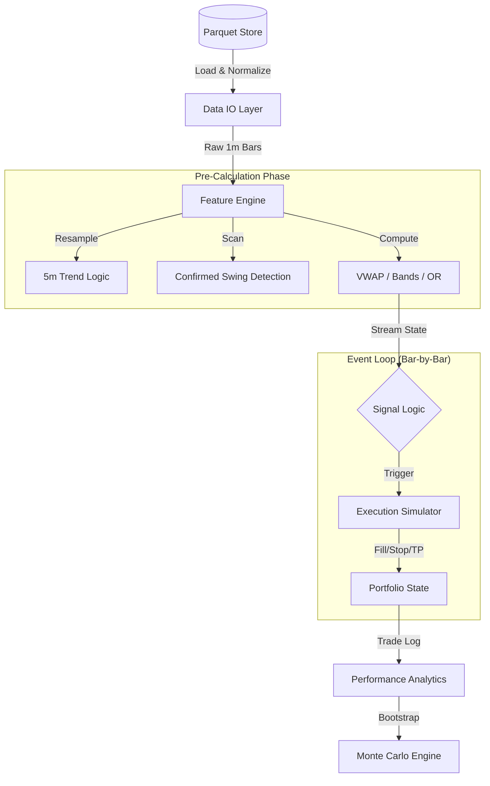

# Meridian Engine Architecture

## 1. System Design
Meridian is an **Event-Driven, Vector-Hybrid Backtester**. It uses vectorized operations for feature pre-calculation (for speed) and an event loop for execution simulation (for path-dependence accuracy).

## 2. Core Subsystems

### 2.1 Feature Engine (`/features`)
Responsible for transforming raw OHLCV data into tradable signals.
* **Hybrid Approach:** Heavy calculations (e.g., VWAP, ATR) are pre-calculated vectorially.
* **Look-Ahead Safety:**
    * All features use strict right-edge labeling.
    * **Swing Detection:** Uses a `find_swings_1m` algorithm that requires `rb` (right-bars) confirmation before marking a pivot.

### 2.2 Signal Logic (`/logic`)
Implements the specific trading strategy (Strategy 3A).
* **Constraints:** `OR Break`, `Pullback Zone`, `Micro-Structure Entry`.
* **Gating:** `disqualify_after_unlock` ensures failed setups are discarded immediately.

### 2.3 Execution Simulator (`/engine`)
A deterministic simulation of an exchange matching engine.
* **Slippage Model:** Deterministic tick-based penalty (e.g., `+1 tick` on Stop, `+1 tick` on Entry). No random noise is applied in the baseline configuration.
* **Lifecycle:** Handles `TP1` scaling, `Breakeven` adjustments, and `Time-Based Exits`.

## 3. Determinism Contract
Meridian guarantees bit-perfect semantic reproducibility (within float tolerance) given the same inputs.

### 3.1 Sources of Stochasticity
* **Monte Carlo:** Uses `numpy.random.default_rng(seed)` seeded via `run_meta.json`.
* **Execution:** Strictly deterministic. Randomness is only introduced if specific "Fuzzy Fill" modules are enabled and explicitly seeded.

### 3.2 Guards Against Divergence
1.  **Iteration Order:** All dictionary iterations sort keys (`sorted(dict.keys())`) before processing.
2.  **Float Math:** All critical comparisons use `np.isclose` or epsilon thresholds.
3.  **Pandas Indexing:** Explicit `sort_index()` is called on all dataframes before the event loop begins.
4.  **Timezones:** UTC is canonical at rest; `America/New_York` conversion happens exactly once at load time.

## 4. Artifacts
Every run produces a self-contained output folder with:
* `run_meta.json` (Config + Seeds)
* `summary.json` (Performance Metrics)
* `trades.parquet` (Row-level execution log)
